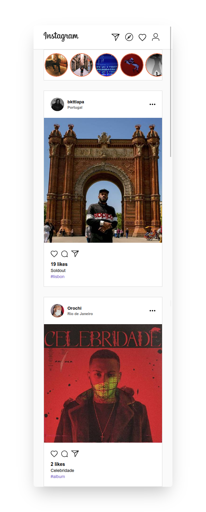

<p align="center">
  
</p>

<p align="center">
  

  
  
  <a href="https://github.com/fariasmateuss/fariasmateuss/commits/master">
    
  </a>

  
</p>
 
<p align="center">
  Application built with ReactJs and Restful API in NodeJs.
</p>



## Features

- [x] Uplooad of photos
- [x] Like in photos
- [x] Snap history
- [x] Real-time application with Socket.io

## Tech

- [NodeJs](https://nodejs.org/en/) - Build the server.
- [ReactJs](https://reactjs.org) - A JavaScript library for building user interfaces.
- [MongoDB](https://www.mongodb.com/) - NoSQL Cluster

## Development setup

### Prerequisites

To run this project in the development mode, you'll need to have a basic environment with NodeJs installed.

#### Back-End

Run in the backend folder;

```
yarn
```

To start the server;

```
yarn dev
```

Open Insomnia or Postman and import the Insomnia.json workspace file at backend folder.

#### Front-End

Run in the frontend folder;

```
yarn
```

To start the project;

```
yarn start
```

## Contribution

See the [contribution guide](./github/CONTRIBUTING.md) for more details on how to contribute to this project.

# License

[MIT License](/LICENSE)
